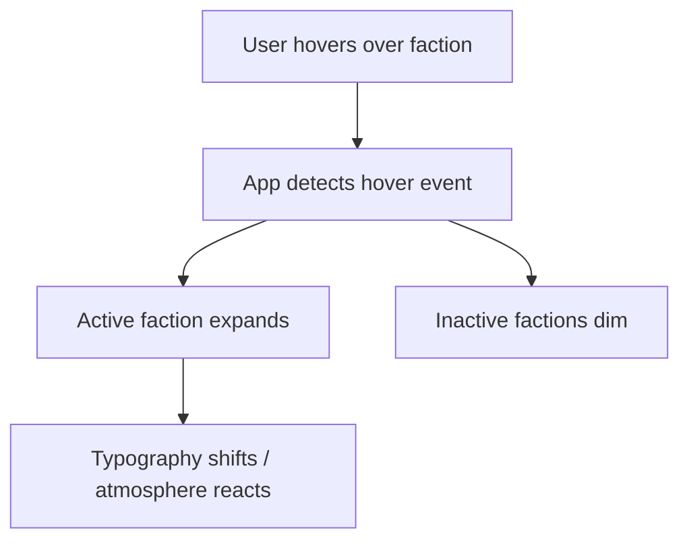

# Hero Faction Screen
**SCAD AI 201 — Project 1**

> You are the Lead UI Designer. Build the screen where players choose their fate.

**Live URL:** https://tinale21.github.io/test2/

---

## Design Intent

*To be completed before AI engagement — Session 2 (3/25/26)*

---

## Mermaid Diagram

*To be added after design is finalized.*



---

## AI Direction Log

*3–5 entries documenting what was asked, what AI produced, and what was changed/rejected/kept and why.*

| # | Prompt | AI Output | Decision |
|---|--------|-----------|----------|
| 1 | Add a glowing elliptical character base beneath the selected hero | Three-layer teal pedestal: outer bloom, visible rim border, bright inner oval | Rejected — intersected character shoes, then too subtle after repositioning; removed entirely |
| 2 | Add a selection glow behind the hero character | Diffuse radial aura behind character body | Rejected — too body-shaped; replaced with vertical spotlight column + floor glow treatment |
| 3 | Fix floor glow being clipped at the front | Removed `overflow: hidden` from `.zone-center` | Rejected twice — broke hero scaling and stage layout; settled on Option 2 (lift element + reduce blur) |
| 4 | Add background image as subtle atmospheric layer | `body::before` pseudo-element with `brightness(0.32) saturate(0.45) contrast(0.85) opacity(0.72)` | Kept — blends without competing with UI |
| 5 | Add character emblems above name in stats panel | Per-character emblem images with individual size and spacing overrides | Kept after iterative tuning of size and margin per character |

---

## Records of Resistance

*3 documented moments where AI output was rejected or significantly revised.*

**1.**
- What AI produced: A glowing teal pedestal platform beneath the selected hero character with three CSS layers (bloom, rim, inner oval surface), styled to look like a selection stage.
- Why rejected: The platform intersected the character's shoes no matter how it was repositioned. After fixing the clipping, the glow was too faint. After boosting, it still did not satisfy. The feature was removed entirely.
- What I did instead: Removed the base and replaced the selection treatment with a vertical spotlight column and floor glow behind the character instead.

**2.**
- What AI produced: Removed `overflow: hidden` from `.zone-center` to allow the floor glow to render past the container boundary — implemented twice, and once as a structural refactor (moving elements outside `.hero-base-wrap` with selective clipping).
- Why rejected: Each attempt either broke the hero character's scaling and centering in the stage area, or introduced layout side effects that were unacceptable.
- What I did instead: Reverted all three attempts. Resolved the clipping by lifting the floor glow element and reducing the blur radius so the bleed stays within the existing container bounds (Option 2).

**3.**
- What AI produced: Increased the hero spotlight glow intensity — column opacity 0.28→0.55, floor opacity 0.35→0.60 — after being asked to "increase the glow."
- Why rejected: The increased glow overpowered the interface and competed with the UI elements.
- What I did instead: Reverted to the previous lower-opacity values.

---

## Five Questions Reflection

*To be completed before submission.*

---

## Local Development

```bash
npm install
npm run dev
```

Runs at `http://localhost:5173/test2/`
