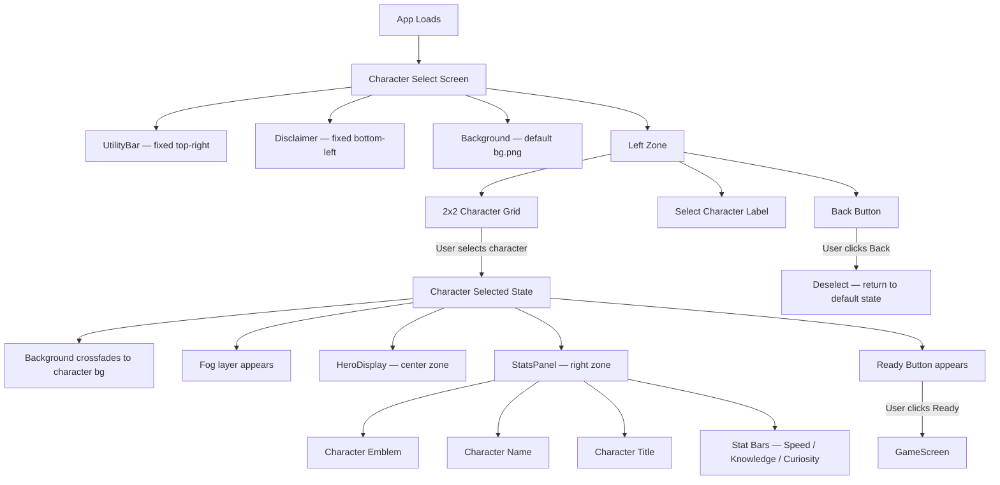

# Hero Faction Screen
**SCAD AI 201 — Project 1**

> You are the Lead UI Designer. Build the screen where players choose their fate.

**Live URL:** https://tinale21.github.io/test2/

---

## Design Intent

See [`claude/design-intent.md`](claude/design-intent.md)

---

## Mermaid Diagram

*To be added after design is finalized.*



---

## AI Direction Log

See [`claude/ai-direction-log.md`](claude/ai-direction-log.md)

---

## Records of Resistance

See [`claude/records-of-resistance.md`](claude/records-of-resistance.md)

---

## Five Questions Reflection

This project reflects my creative direction because each major design decision was prompted by me and included my intent for the functionality and visual direction of the screen flow. I used AI as a tool for refinement and execution rather than letting it make the decisions for me. I checked that things work by constantly testing that all interactions, spacing, alignment, etc. matched what I intended after each prompt. I do have a solid understanding of the process of vibe coding now that I have gone through the process and experience the trail and errors. My documentation is honest because it reflects my exact prompts, what AI prompted, and the adjustments I made to achieve my own vision.

---

## Local Development

```bash
npm install
npm run dev
```

Runs at `http://localhost:5173/test2/`
