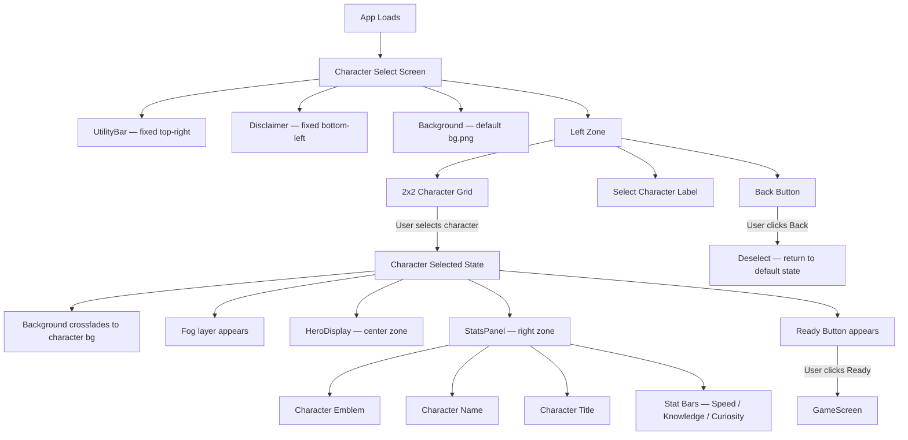

# Hero Faction Screen
**SCAD AI 201 — Project 1**

> You are the Lead UI Designer. Build the screen where players choose their fate.

**Live URL:** https://tinale21.github.io/test2/

---

## Design Intent

*To be completed before AI engagement — Session 2 (3/25/26)*

---

## Mermaid Diagram

*To be added after design is finalized.*



---

## AI Direction Log

See [`claude/ai-direction-log.md`](claude/ai-direction-log.md)

---

## Records of Resistance

See [`claude/records-of-resistance.md`](claude/records-of-resistance.md)

---

## Five Questions Reflection

*To be completed before submission.*

---

## Local Development

```bash
npm install
npm run dev
```

Runs at `http://localhost:5173/test2/`
