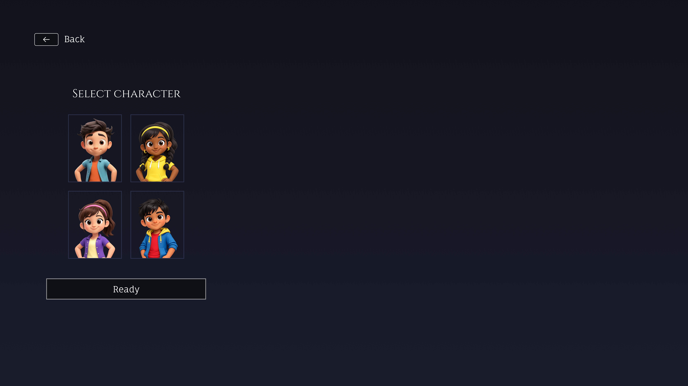
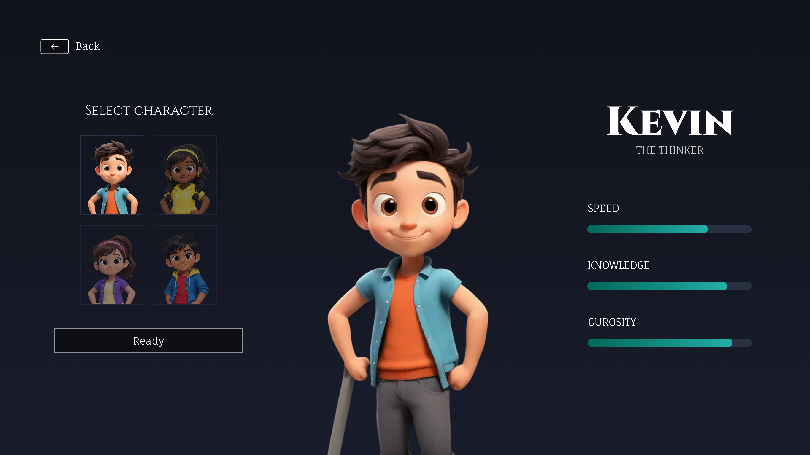

# Design Intent — Hero Faction Character Select
**Project 1 | AI 201 | Written before AI engagement with code**

---

## Original Screen Flows

These are the five reference screens submitted before AI engagement. They served as the visual source of truth for the entire prototype. The screens were designed in Figma prior to any AI or code engagement.

**Default State — No Selection**

**Kevin Selected**

**Rae Selected**

**Hanna Selected**

**Daniel Selected**

---

## Purpose

This is an interactive animated prototype for an already-designed character select screen. The screens, layout, visual styling, and character art are already created. The purpose of this prototype is to make those static screens feel functional through motion, interactivity, and state changes. This is not a redesign task. The AI should treat the existing screens as the visual source of truth and focus on building the animations and prototype logic around them.

---

## Layout and Interaction States

The layout should preserve a three-zone composition. The prototype should begin with a first screen that displays only the four character options. At this stage, users should only see the selectable character thumbnails and should be able to click on any one of the four characters to begin the selection process. No large hero character or detailed stats should appear until a character has been selected.

Once a user selects a character, that selected option should remain at 100% opacity, while the other three character options fade to 50% opacity to create a clear visual hierarchy. At the same time, the chosen character should appear in the center of the screen as a larger hero figure. This hero character should perform a subtle idle animation, such as a small wave, to make the prototype feel more alive and interactive.

After selection, the character's stats should appear on the right side of the screen. This section should display the character's name along with their Speed, Knowledge, and Curiosity values. If the user decides to select a different character, the same process should repeat: the newly selected character becomes fully visible, the remaining options fade to 50% opacity, the center hero character updates, and the stats panel changes to match the new selection.

Once the user is satisfied with their choice, they can click the Ready button to continue. When hovered, the Ready button should show a glowing blue outline to indicate that it is interactive and is the primary action on the screen. After clicking Ready, the user should be transported into the game.

---

## Thumbnail Interaction Rules

When a character is selected, the chosen thumbnail should remain at 100% opacity so it feels active, prioritized, and clearly locked in as the current selection. All other unselected character thumbnails should fade to 50% opacity to create a stronger visual hierarchy and make the active choice immediately obvious. This opacity shift should animate smoothly rather than change abruptly, with a transition of around 200 to 250 milliseconds using an ease-out curve. If the user hovers over an unselected thumbnail, it can lift slightly above 50% opacity for feedback, but it should still remain visibly secondary until clicked. This behavior helps guide attention toward the selected character while keeping the other options available but visually subdued.

---

## Button Rules — Ready and Back

Use this rule for the "Ready" and "Back" button. In the default state, the button should keep its current styling with a fill of #0E0F14 at 100% opacity and a 2px inside stroke in #959499 at 100% opacity. The button should feel quiet and inactive by default, with no glow or animated border until the user hovers over it. When the user hovers over the button, the stroke should transition from the static #959499 outline into an animated glowing blue outline. The base stroke color should shift to a cool blue such as #6FA8FF at around 85 to 100% opacity, and a soft outer glow should appear around it using a lighter blue. The glow should feel diffused and elegant, with a blur of roughly 10 to 16px, so it reads as luminous without becoming neon or harsh. The glow should also feel animated rather than static. It should have a very subtle pulsing or breathing effect, where the blue outer glow gently increases and decreases in intensity while the cursor remains hovered. This pulsing should be slow and restrained, looping around every 1.5 to 2 seconds, and should only affect the glow strength and slight brightness of the stroke, not the button's size or layout. The transition into the hover state should animate smoothly over about 180 to 220 milliseconds with an ease-out timing. When the cursor leaves the button, the glowing blue outline should fade back into the default #959499 stroke over about 180 milliseconds, with the glow disappearing softly rather than cutting off abruptly. The blue should stay soft, premium, and controlled, matching the dark cinematic tone of the interface.

---

## Color Palette, Characters & Stats, and Motion
*The following sections were extracted by the AI from the reference screen images and character assets provided. They were not directly typed as prompts.*

**Color Palette:** Background #0f1923 (deep navy). Stat bar fill #00b8a0 (teal). Stat bar track: dark navy. Text #ffffff. Button fill #0E0F14. Button stroke default #959499. Button stroke hover #6FA8FF. Font (character names): Playfair Display. Font (labels/stats): uppercase sans-serif.

**Characters & Stats:** Kevin, The Thinker — Speed 65%, Knowledge 75%, Curiosity 45%. Hanna, The Risk-Taker — Speed 65%, Knowledge 75%, Curiosity 50%. Rae, The Brains — Speed 70%, Knowledge 90%, Curiosity 55%. Daniel, The Explorer — Speed 65%, Knowledge 80%, Curiosity 90%. Character art: static PNG assets, white backgrounds handled with mix-blend-mode: multiply.

**Motion:** All state changes are animated — nothing cuts abruptly. Motion is restrained and purposeful — not flashy. Idle animation is alive but not distracting. Stat bar fill is the most expressive animation on screen.
